<h1>Perde</h1>

  Perde was developed by a team of 5 in Poland for a University of Lodz Application Servers course. Our goal is to create a simple movie viewing page.

  Note that! movies are representative :)

<h2>Features</h2>
<ul>
  <li>Users can watch film trailers and films.</li>
  <li>Users can search for movies and view a list of movies.</li>
  <li>Display film details.</li>
  <li>Allow users to rate films and leave comments.</li>
  <li>Filter films by categories, directors, years, ratings</li>
  <li>Users can create accounts, log in, and manage their profile information.</li>
</ul>

<h2>Technologies Used</h2>
<ul>
  <li>Frontend: HTML, CSS, JavaScript, Bootstrap</li>
  <li>Backend: Django, Python</li>
  <li>Database: SQLite</li>
</ul>

<h2>Requirements</h2>

Download this project and then type 'pip install django-filters' in the console and you're done!

<h2>Team</h2>
<ul>
  <li>Samet Çağrı Aktepe</li>
  <li>Şükrücan Ahmet Köseoğlu</li>
  <li>Meltem Özen</li>
  <li>Dilan Önal</li>
  <li>Erencan Ekinci</li>
</ul>

<h2>Screenshots</h2>

  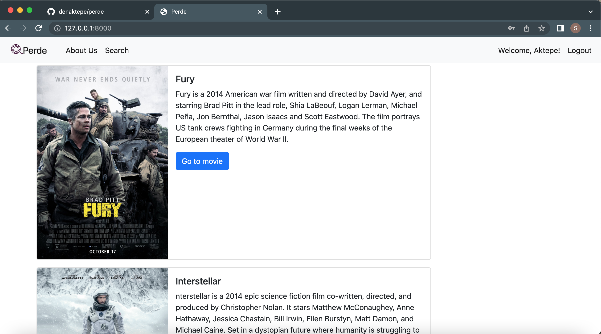
  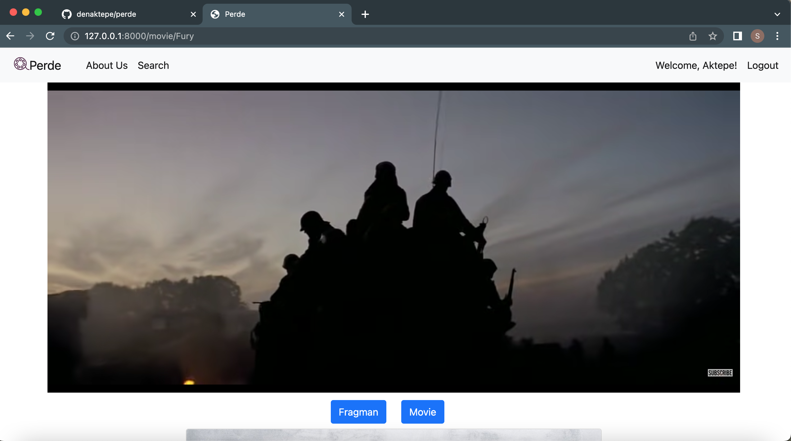
  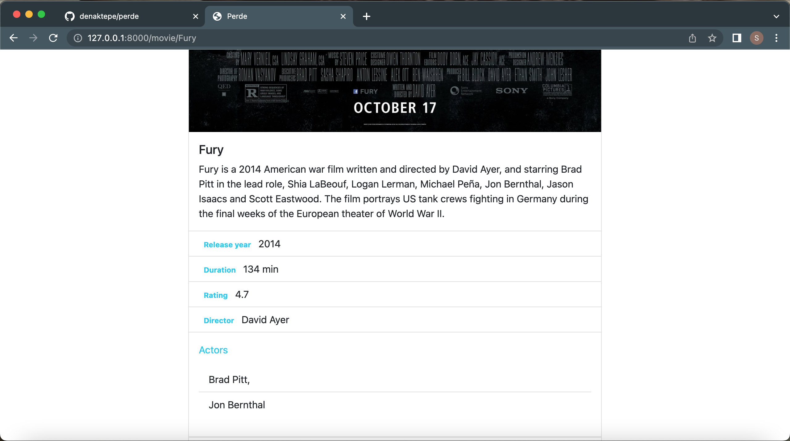
  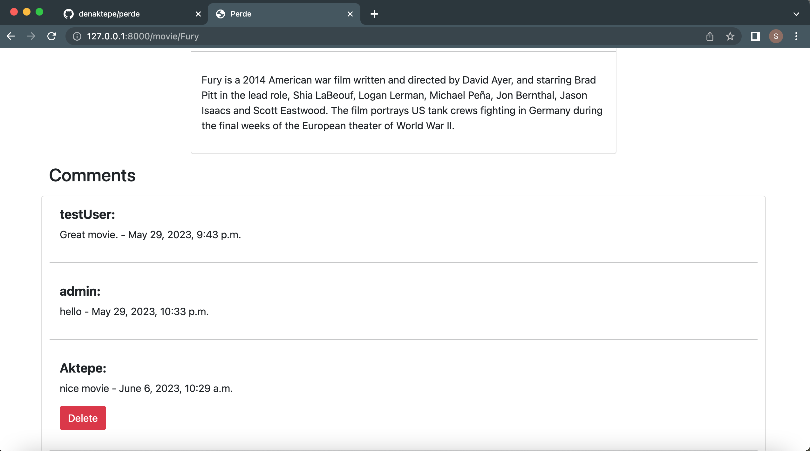
  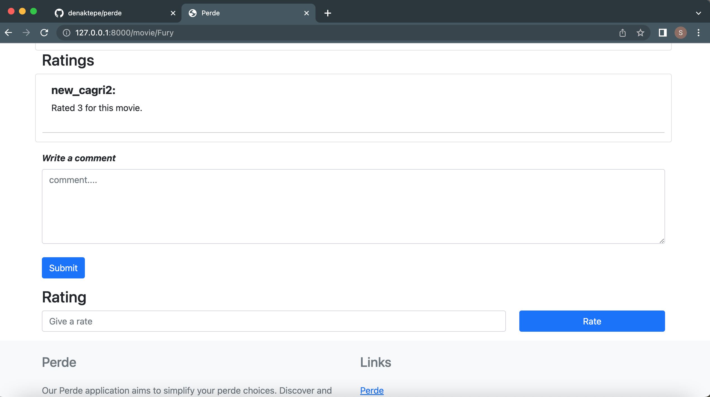
  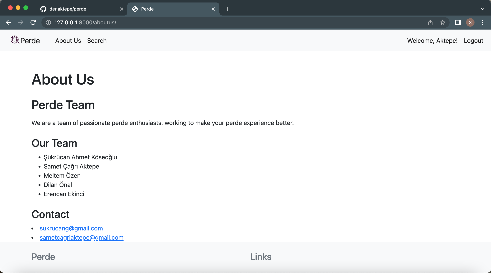
  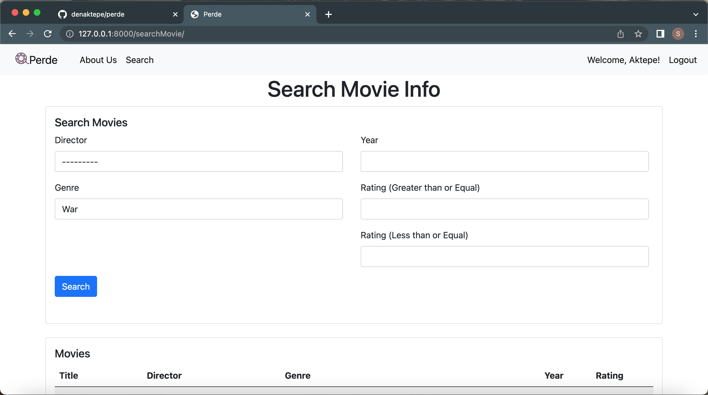
  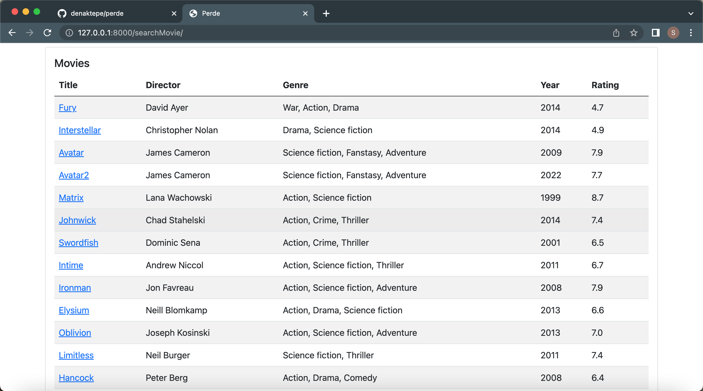
  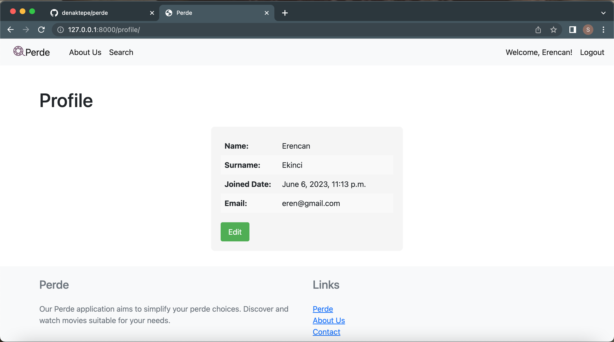
  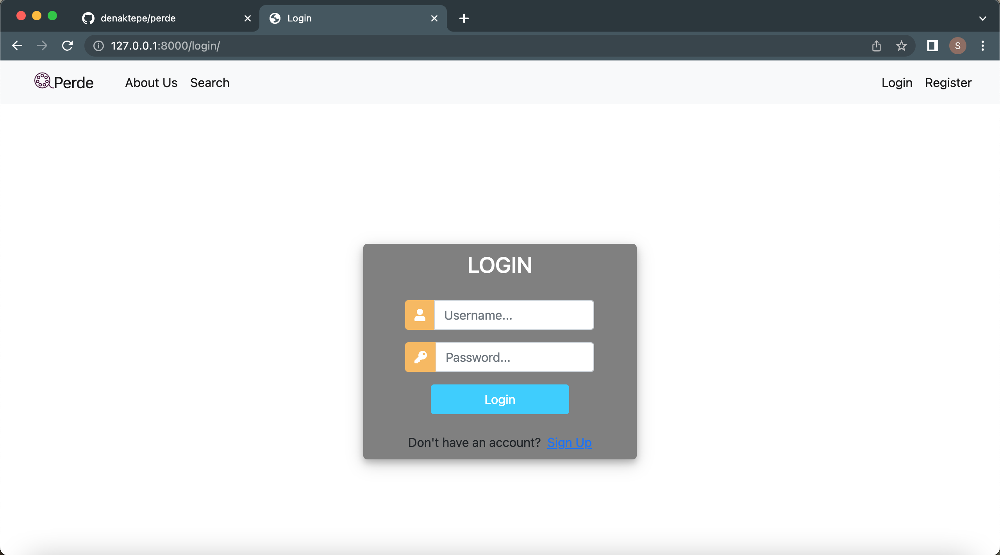
  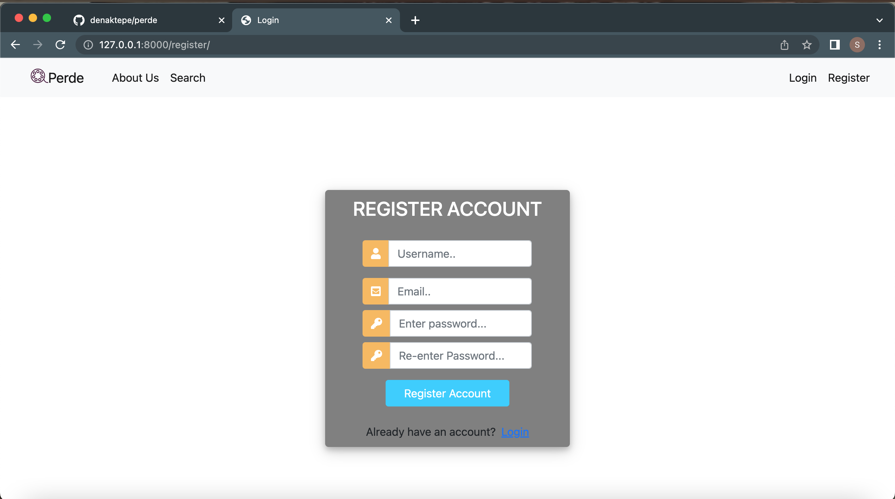

